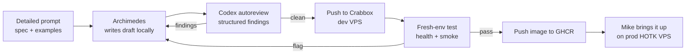
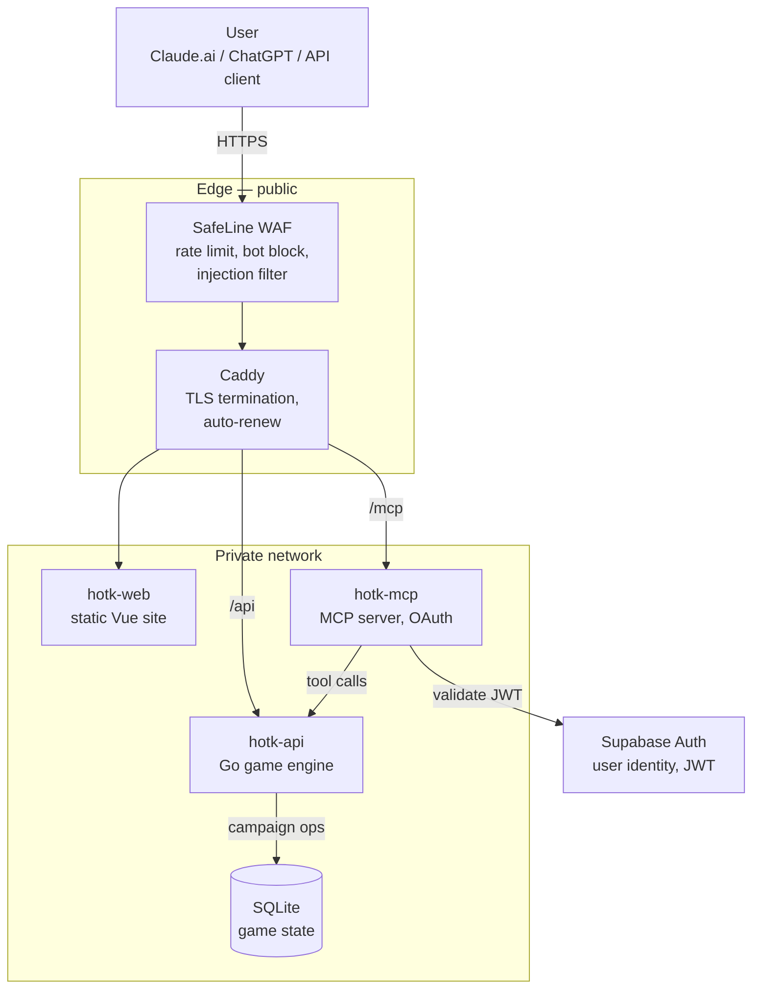
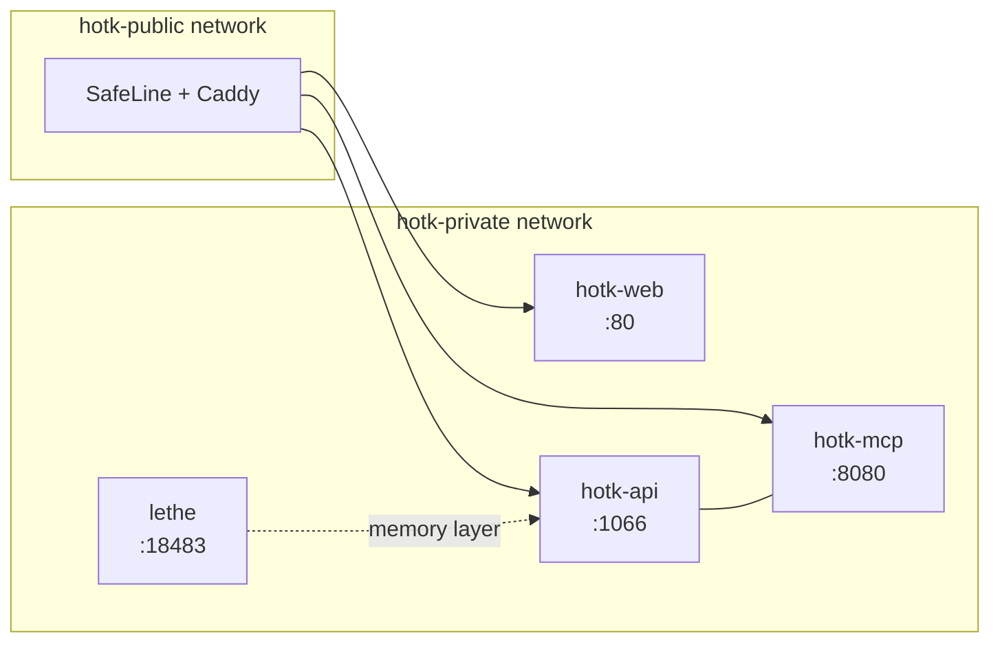

I built a strategy game called **Hand of the King**. It's a single-player kingdom management thing inspired by *King of Dragon Pass* — you play a foreign ruler advising a medieval court, making trade deals, fighting wars, and trying not to get assassinated. The game engine is Go. The web frontend is Vue 3. The narrative is LLM-generated. The game is hard. It still has bugs. We are actively working through them.

This post isn't about the game. It's about the infrastructure I built to run it.

I don't host on Vercel or any of the managed PaaS layers. Not because they're bad — they're fine. I don't use them because **I can do the hard part that everyone pays a service to handle badly**: the security, the CI, the hardening, the boring ops work that nobody enjoys and most companies half-ass. That's the work I want to own. The rest of the game stack can come from anywhere.

A note on how I work: I don't write code. I write very detailed prompts — specs, examples, the resources to consult, the patterns to follow — and hand them to my agent. He writes the first draft. Then the loop starts. The infra story below is mostly that loop, and it's worth understanding before you decide any of this is a good idea.

I'm also a picture guy. Words work, but I think in diagrams. So there are Mermaid diagrams throughout this post showing how each piece fits together.

---

## The Agentic Loop

Here's the workflow that produced everything in this post:



1. **I write the prompt.** Spec, examples, links to relevant docs, the test command, the success criteria.
2. **Archimedes writes the draft.** He has full access to the repo, the test suite, the Docker environment, and the game's design doc. First pass is rough, but it's running.
3. **The [autoreview skill](https://github.com/mentholmike/agent-skills) kicks off a Codex pass.** This is a structured closeout check — Codex reads the diff cold and returns findings with severity, file paths, and suggested fixes.
4. **Archimedes verifies each finding against the real code** (not blindly applied) and either patches it or rejects it with reasoning. If a fix changes code, the loop restarts: focused tests, then another Codex pass.
5. **The patch goes to Crabbox** — a disposable dev VPS with the same specs as prod. Fresh environment, clean slate. Nothing carries over from my machine.
6. **Archimedes tests on Crabbox.** Health endpoints, smoke tests, the full game loop. Whatever he finds, we go back to step 4.
7. **If Crabbox is clean, the image gets pushed to GHCR.** Then I bring it up live on the prod HOTK VPS. I don't have to log in or babysit.

The loop keeps going until Codex returns clean. No accepted findings, no ship. I let Archimedes do the testing for me. Whatever he flags on Crabbox, we run another autoreview pass and start the process over until we're cleared.

**The key thing about this loop is patience.** A single Codex review pass can take anywhere from five minutes to half an hour depending on the size of the diff and whether it pulls in dependency docs. The skill explicitly tells you not to kill a review just because it's been quiet for a few minutes — those long silences are usually the model doing real work, not a hang. I learned this the hard way: my first instinct was to interrupt runs that looked slow, and I shipped a bug that the review would have caught.

**Codex is the reviewer of record, not Archimedes.** Archimedes writes code with strong priors. Codex comes in cold, with fresh context, and looks for things the author wouldn't. That's the whole point — a second model catches what the first one rationalizes away. ([Peter Steinberger](https://steipete.me) has been hammering on this idea for years, and he's right: a single-model loop is just the model agreeing with itself. Two models, structured handoff, real review.)

**Bugs this has caught:**

- A race condition in my session manager that I missed in three manual reviews.
- I was using `len()/4` for token counting instead of `utf8.RuneCountInString()/4`, which broke on non-ASCII narrative text (the game generates a lot of accented character names).
- My `/compact` endpoint was returning the summary nested inside a `session` object while the plugin expected it at the top level — a bug that would have broken memory bootstrap on every restart.
- The MCP OAuth token resolver was swallowing errors instead of propagating them, masking a config bug on the Supabase side.

On the HOTK campaign engine, the autoreview loop has caught at least one substantive bug per merge for the last three months. That compounds.

---

## The End-to-End Architecture

Here's the full picture, from the user's browser to the SQLite file on disk:



Two public entrypoints: `hotk.dev` for the website and dashboard, and `mcp.hotk.dev` for MCP. Both go through the same edge stack. Everything internal is on a private Docker network that nothing outside the VPS can touch directly.

---

## CI/CD: Crabbox → GHCR, Not GitHub Actions

I don't use GitHub Actions for deploys. The autoreview loop is the CI. Here's the actual flow:

1. **Archimedes writes the code locally.**
2. **Codex autoreview runs.** If findings → back to step 1.
3. **Push the image to Crabbox** (disposable dev VPS, same specs as prod).
4. **Run smoke tests on Crabbox.** Health endpoints, API responses, full game loop. If flags → back to step 1.
5. **Push the final image to GHCR.** `ghcr.io/mentholmike/hotk-api`, `ghcr.io/mentholmike/hotk-web`, `ghcr.io/mentholmike/hotk-mcp`. All on GHCR — no Docker Hub for HOTK containers.
6. **I bring it up on the prod HOTK VPS** with `docker compose pull && docker compose up -d`.

**Why Crabbox matters.** My local environment has accumulated state — running services, half-finished migrations, test fixtures, port assignments. Crabbox is clean every time. It catches environment-specific bugs that would never show up on my machine: missing env vars, wrong DNS resolution, container network issues, permission problems. I've found dozens of issues this way that would have taken down prod.

**Multi-arch builds** for `linux/amd64` and `linux/arm64` happen locally on my Mac mini. One hard lesson: esbuild (the JS bundler) doesn't run well under QEMU emulation. If you're building a static site inside a Docker container on Apple Silicon and targeting amd64, the build will randomly die. The fix is to build static assets on the host (arm64 native), then copy them into an amd64 runtime image. I maintain a separate `Dockerfile.amd64` for this path.

**Image retention:** only `latest`, the current semver, and one previous version are kept on GHCR. Everything else gets cleaned up automatically. I learned this the hard way after racking up 57 orphaned image versions.

---

## Docker Compose Setup

The production stack is six services on a single VPS:



Only the edge proxy attaches to `hotk-public`. The game engine, MCP server, and Lethe live on `hotk-private` and are unreachable from the internet directly.

**Hardening choices baked into every container:**

- **Read-only root filesystems.** Containers can't write to their own filesystem. Nginx needs `/tmp`, `/var/cache/nginx`, and `/var/run` as `tmpfs` mounts so it can still start.
- **`no-new-privileges` security option.** Containers can't escalate.
- **Non-root users.** Nginx runs as `nginx:nginx`. The game engine runs as a dedicated `hotk` user. Nothing runs as root inside a container.
- **No Docker socket exposed.** The game engine doesn't need to launch other containers, so it doesn't get the socket. If that changes later, I'll use a Docker socket proxy with limited verbs, not raw `/var/run/docker.sock`.
- **Healthchecks** on every service — the edge proxy only routes to containers that pass their health check.

Compose files live in the repo. Secrets are in `/etc/hotk/*.env` on the host, never in git. Service images are pinned to commit SHAs in compose, never to floating tags.

---

## Reverse Proxy: SafeLine at the Edge

**SafeLine is the front door.** It works as both a WAF and a reverse proxy — rate limiting, bot detection, common attack pattern matching, and injection filtering all happen there before a request ever touches the game stack. It's already up and running. It's already blocked real injection attempts. That's not theoretical anymore.

**Why SafeLine and not Caddy alone?** Because Caddy is a great reverse proxy and a terrible WAF. You want a real attack-filtering layer in front of your actual services when there's a public beta and random IPs are hitting your endpoints. SafeLine gives me that without me having to write mod_security rules by hand.

Caddy is still in the stack as the TLS terminator and internal router. SafeLine handles the public edge; Caddy handles the rest. They're complementary, not competing.

The principle: assume you're getting scanned constantly, because you are. Block bad traffic as far from your real services as possible.

---

## Linux Hardening

The VPS baseline is strict. A lot of time and effort went into making this a thoughtful, secure experience — not just the default Ubuntu install with UFW enabled.

**SSH:**

- **Moved off port 22** to a non-standard port. Don't expose the well-known port to the internet.
- **Key-only auth.** Password authentication disabled in `sshd_config`.
- **Tailscale-only access.** SSH is restricted to my Tailscale network and one backup IP. Random scanners can't even see the SSH port.
- **Non-root deploy user.** No direct root login. The Docker daemon runs under a dedicated user.

**Active defense:**

- **fail2ban** running with the default jails enabled. Bans repeat offenders automatically.
- **SafeLine WAF** at the edge (see above).
- **UFW** default deny inbound. Only the SSH-port-equivalent and `80/tcp`/`443/tcp` are open.

**System hygiene:**

- **Unattended security updates** for critical patches.
- **Log rotation** on nginx, application logs, and journald. No filling the disk.
- **Daily backups** of SQLite databases (game state, Lethe memory) — dumped, compressed, rotated with 7-day retention, offsite copy.

The goal isn't enterprise paranoia. The goal is: default deny, minimal exposure, recoverable state, and the boring stuff done right.

---

## MCP: The Part I Actually Show Off

This is the part that makes people lean forward. I've installed a custom MCP service on Claude that lets the frontier model — Sonnet 4.6, the same one I'm talking to right now — play Hand of the King based on your campaign ID. It works over the public internet. No local install. No special client.

Here's what it looks like in practice. This is a real conversation with Claude, against a real HOTK campaign on the prod VPS:


Claude is reading the live game state, identifying the most urgent council business, naming the houses and their loyalty scores, and proposing a strategic response. That's not a canned prompt — it's the MCP server translating Claude's tool calls into real HTTP requests against the HOTK API, returning structured game state, and letting the model reason about it.

The second view shows the docket — the actual action choices the player can make:


Each action card has a probability, a cost in gold or legitimacy, and predicted effects. Claude sees all of this, weighs the trade-offs, and makes a decision.

**The MCP server itself is at `mcp.hotk.dev/mcp`.** When a client connects, it hits the OAuth discovery endpoint:

```
GET https://mcp.hotk.dev/.well-known/oauth-protected-resource
```

Which returns:

```json
{
  "authorization_servers": ["https://yccnaslxsopkxztamgpq.supabase.co/auth/v1"],
  "resource": "https://mcp.hotk.dev/mcp",
  "scopes_supported": ["email"]
}
```

The client redirects to Supabase Auth, the user logs in, and Supabase issues a JWT. The MCP server validates it on every request. No API keys pasted into chat windows. No static bearer tokens shared across users. Real OAuth with PKCE.

**How you actually use it:**

1. Sign in at `hotk.dev` with your Supabase account.
2. Go to your dashboard → API Keys → Generate New Key.
3. Copy the key.
4. In Claude, add a custom MCP connector, paste the MCP URL + the key.
5. Start a new chat. Claude now has the game tools loaded.

**You can revoke the key at any time** from the same dashboard. One click, it's dead. The next request from Claude gets a 401, the tool list goes away, and the conversation degrades gracefully. That's the security model: identity is OAuth, scoped access is API keys, revocation is instant.

**Why this matters:** the old approach (copy-paste a static bearer token into a chat window) is faster to set up but creates a security debt you'll pay later. OAuth gives me user identity, scoped permissions, and an audit trail. Static keys get you 80% of the functionality with 20% of the security model, and the 20% you skipped is the part that bites you.

---

## Lethe: The Memory Layer

**Lethe** is the piece nobody sees and the one I'm most proud of.

It's a persistent memory layer for AI agents. The problem it solves is simple: every time my agent (Archimedes) starts a new session, he wakes up with zero context. He doesn't remember what we were working on yesterday, what bugs we fixed, or what decisions we made.

Lethe fixes that. It's a Go server backed by SQLite, running at `localhost:18483`, with an OpenClaw plugin that hooks into every agent turn. On every message, it auto-logs:

- What the user said
- What tools the agent used
- What the agent decided
- Any flags (uncertainties, blockers, things to revisit)

On session start, the plugin fetches a **compact summary** of the previous session and prepends it to the agent's system prompt. So when Archimedes wakes up, he reads something like:

> *"Previous session: fixed token counting bug, shipped Lethe v0.1.2, 3 open flags remain: thread auto-logging needs cleanup, template capitalization inconsistency, wildcard search escaping."*

Then he knows where we left off.

The Lethe server also has a web UI for browsing sessions, events, checkpoints, and flags. I use it to review what the agent did when I wasn't watching — which is often, because he runs benchmarks hourly while I sleep.

Lethe is open source: [github.com/openlethe/lethe](https://github.com/openlethe/lethe). The plugin is bundled. The skill file teaches any agent how to use it.

---

## Supabase: Auth and User Data

**Supabase Cloud** handles all user-facing auth: registration, login, password resets, OAuth (Discord, Google), and JWT sessions.

Why Supabase Cloud and not self-hosted? Because self-hosting Supabase means running Postgres, GoTrue, Realtime, Storage, Kong, and email/OAuth config yourself. That's a full-time job. For a closed beta with a small user pool, Supabase Cloud is the right tradeoff: enterprise auth without the ops overhead.

Supabase stores user profiles, API key hashes (bcrypt), and subscription status. It does **not** store game state — campaigns, turns, and events live in SQLite on the HOTK VPS. The separation is intentional: auth data is user-platform, game data is game-platform. If Supabase has an outage, existing games keep running.

---

## What This Cost (in Time, Not Money)

The VPS is $5/month. The domain is $12/year. Supabase free tier covers the beta user count. GHCR is free for public repos. The only real cost is time.

**Time breakdown:**

- Agentic autoreview loop: ~2 weeks to get reliable
- CI/CD workflow (Crabbox → GHCR): ~1 week once the loop was solid
- Crabbox testing workflow: ~1 day
- Docker Compose + hardening: ~1 week
- MCP + OAuth: ~1 week (OAuth is fiddly)
- SafeLine deployment + tuning: ~3 days
- Lethe: ~3 weeks (the plugin was the hard part)
- WAGMIOS (the Docker management platform that runs the homelab): ~2 months, but that's a separate project

Total: about 2 months of evenings and weekends. Not trivial, but not a full-time job either.

---

## What I Learned

**Self-hosting is slower than SaaS, but you own the debugging.** When something breaks at 2 AM, I can SSH in, read the logs, and fix it. I don't open a support ticket and hope.

**AI agents are force multipliers, not replacements.** Archimedes doesn't write code I couldn't write. He writes code I don't have time to write, catches bugs I'd miss, and runs tests while I sleep. The loop is: I do the thinking, he does the repetitive execution.

**Two-model review is the only review that works.** A single-model loop is the model agreeing with itself. Codex coming in cold, with fresh context, catches things the author rationalizes away. Peter Steinberger's been saying this for years. He's right.

**OAuth is worth the pain.** The static bearer token approach (paste a key into a chat window) is faster to set up but creates a security debt you'll pay later. MCP with real OAuth took longer to build, but now I have user identity, scoped permissions, and an audit trail — and keys that can be revoked instantly.

**Read-only containers are free security.** It costs nothing to add `read_only: true` and `tmpfs` mounts to your compose file. It buys you a lot if someone ever compromises a container.

**Boring ops work is the actual product.** Moving SSH off 22, fail2ban, WAF, hardened containers, key-only auth, off-port TLS — none of this is exciting, all of it is what separates a real deployment from a hobby project. Most services skip it. I don't.

**Document your decisions.** The `vpsdesign.md` file in the HOTK repo is the single most valuable document I wrote. Every time I come back to this project after a week away, I read it first. It saves me from re-discovering my own reasoning.

---

## What's Next

1. **Multiplayer.** Designed, not shipped. Room codes, WebSocket lobbies, hosted game instances. The single-player loop is solid; the next step is letting real humans play together.
2. **Stripe billing.** Manual tier assignment now, automated subscriptions later.
3. **Lethe v0.2.** Project-level scrum board, better search, cross-project memory.
4. **CKA.** I'm studying for the Certified Kubernetes Administrator exam. The homelab already runs Talos Linux, ArgoCD, and Longhorn. This stack is my practice ground.
5. **More posts.** I want to write up the MCP integration, the Lethe plugin, and the autoreview loop as standalone pieces. The infra is the hard part; the game is the reason for it.

---

## The Code

Everything is open source:

- **HOTK game + API**: [github.com/mentholmike/hotk](https://github.com/mentholmike/hotk)
- **HOTK web frontend**: [github.com/mentholmike/hotk-web](https://github.com/mentholmike/hotk-web)
- **HOTK MCP server**: [github.com/mentholmike/hotk-mcp](https://github.com/mentholmike/hotk-mcp)
- **Lethe memory layer**: [github.com/openlethe/lethe](https://github.com/openlethe/lethe)
- **WAGMIOS homelab platform**: [github.com/mentholmike/wagmios](https://github.com/mentholmike/wagmios)
- **Agent skills (autoreview + more)**: [github.com/mentholmike/agent-skills](https://github.com/mentholmike/agent-skills)
- **This site**: [github.com/mentholmike/mwyatt.me](https://github.com/mentholmike/mwyatt.me)

If you're building something similar, steal what works, ignore what doesn't, and tell me what you did differently. I'm always looking for better ways to do this.
