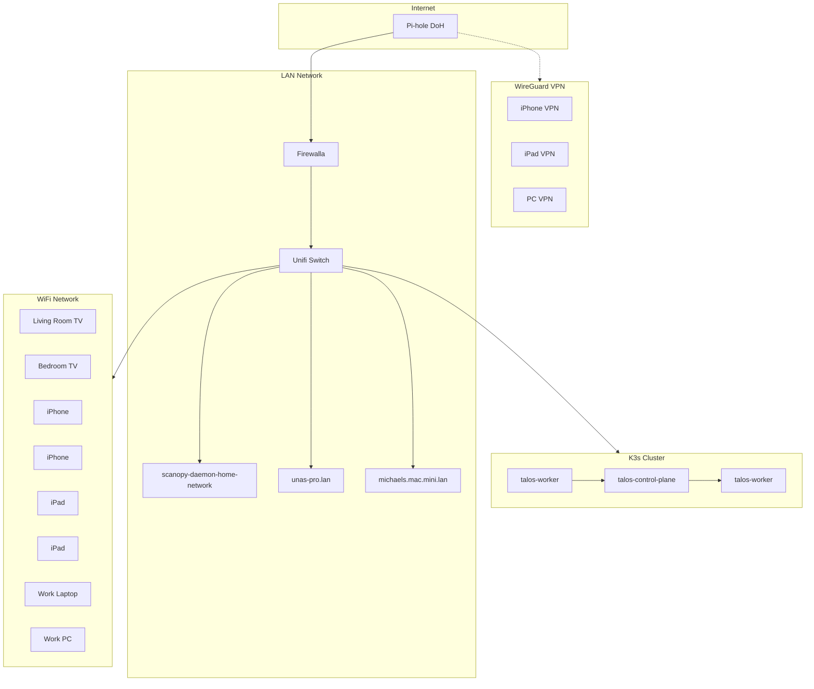

I run a home network that is more carefully segmented than most small offices. This isn't performative over-engineering — I actually use every layer, and when something breaks at 2 AM I want to know exactly which hop failed without guessing.

This post is the public version. The network topology, the cluster architecture, and the GitOps workflow are all documented in the open. The actual manifests for the full cluster live in a private repo, because not everything I self-host needs to be interview material. What you're reading is the curated portfolio: the parts I'm comfortable showing, and the reasoning behind the parts I'm not.

I'm also a picture guy. Words work, but I think in diagrams. So there are topology maps throughout.

---

## The Topology

Here's the whole network at a glance:



Five layers, each with a specific job. No layer trusts the others by default. Traffic is filtered at every hop.

---

## Layer 1: The Edge

**Firewalla** sits between the internet and everything else. It handles:

- **Intrusion detection** — Suricata-based, not just port blocking
- **Ad blocking at the network layer** — Pi-hole gets the DNS, but Firewalla drops trackers before they resolve
- **VPN routing** — WireGuard peers terminate here, not on the cluster
- **Device profiling** — Every MAC gets a fingerprint; new devices alert my phone

I moved off consumer routers years ago. The threat model for a home lab is different from a typical house: I have public-facing services, a Kubernetes cluster with persistent volumes, and multiple VPN tunnels. A standard router with UPnP enabled is a liability in that environment.

**The Pi-hole instance** runs DoH (DNS over HTTPS) upstream. My ISP doesn't see what domains I query, and the CDN can't fingerprint me by DNS pattern. The Pi-hole is also the internal resolver for `*.lan` — every service in the cluster gets a human-readable name without leaking internal topology to a public DNS provider.

---

## Layer 2: The Switch

**Unifi Switch** — no cloud key, no Unifi account, local controller only. The switch handles:

- **VLAN segmentation** — Management traffic, cluster traffic, IoT traffic, and guest WiFi are on separate VLANs
- **Port profiles** — The Talos nodes get full bandwidth and jumbo frames for Longhorn replication. The TV and random IoT devices get isolated ports with rate limiting
- **Link aggregation** — The NAS and the Mac mini (which runs Docker and OpenClaw) get LACP pairs to the switch so storage and container traffic doesn't bottleneck on a single gigabit link

The VLAN layout:

| VLAN | Purpose | Devices |
|------|---------|---------|
| 10 | Management | Switch admin, Firewalla, Pi-hole |
| 20 | Cluster | Talos nodes, K3s pod network |
| 30 | Trusted LAN | Mac mini, NAS, workstations |
| 40 | IoT / Media | TVs, smart home gear |
| 50 | Guest WiFi | Isolated, internet-only |

Cross-VLAN traffic is denied by default at the Firewalla. If the smart TV gets compromised, it can't reach the cluster. This sounds paranoid until you read about the latest IoT botnet.

---

## Layer 3: WireGuard VPN

Remote access is through **WireGuard**, not an open port on the cluster. The tunnel terminates at the Firewalla, and I run a **split tunnel**: only traffic destined for the cluster or the LAN routes through the VPN. Regular browsing goes out normally.

Why split tunnel? Two reasons:
1. **Performance** — I don't want Netflix going through my home upload bandwidth
2. **Leak surface** — If the VPN drops, only cluster traffic leaks to the local network, not everything I'm doing

The WireGuard peers are my phone, iPad, and work PC. Each gets a static IP in the `10.200.0.0/24` range. The Firewalla filters by peer IP, so even if someone stole my private key, they'd still need to spoof my assigned address to reach the cluster.

---

## Layer 4: The K3s Cluster

Three **Talos Linux** nodes. Talos is immutable — no SSH, no package manager, no shell. The OS is a single image that boots from disk and runs Kubernetes. If a node dies, I PXE boot a replacement, it joins the cluster, and Longhorn rebalances the storage replicas automatically.

### Nodes

| Hostname | Role | Notes |
|----------|------|-------|
| `talos-control-plane` | Control plane | etcd + API server + scheduler |
| `talos-worker` | Worker | General workloads |
| `talos-worker` | Worker | General workloads |

Control plane runs no pods. Workers handle everything. If a worker fails, pods reschedule and Longhorn rebuilds the replica. If the control plane fails, the cluster keeps running (etcd quorum permitting) until I replace it.

### Why K3s and not full K8s?

Because I'm running this on a mix of recycled hardware and a Mac mini. K3s is a certified Kubernetes distribution that fits in 512 MB of RAM. Full K8s would need more overhead than I have. The trade-off is negligible for a home lab: I don't need the full API server feature set, and K3s ships with a working local-path provisioner and Traefik ingress out of the box.

I replaced the default Traefik with **nginx-proxy-manager** for ingress. Traefik is fine, but I wanted a UI for managing SSL certs and reverse proxy rules. Nginx-proxy-manager gives me Let's Encrypt automation without editing YAML for every new subdomain.

---

## Layer 5: WiFi

Unifi APs on VLAN 40 (IoT/Media) and VLAN 50 (Guest). The work laptop and personal devices connect to a separate SSID that bridges to VLAN 30 (Trusted LAN) so they can reach the cluster directly. Guests get internet-only on VLAN 50.

The TVs are on IoT VLAN 40. They can reach Plex (on the cluster, via nginx-proxy-manager) but they cannot SSH into a Talos node or talk to the NAS. This is where most home networks fail: they put everything on one flat subnet and hope device isolation works at the application layer. It doesn't.

---

## The Cluster Stack

Inside the cluster, the stack is:

```
Talos Linux (immutable OS)
  → K3s (lightweight Kubernetes)
    → ArgoCD (GitOps sync)
      → Kustomize (DRY manifests)
        → Longhorn (replicated block storage)
          → nginx-proxy-manager (ingress + SSL)
```

### ArgoCD GitOps

Every application is a directory in the repo:

```
Apps/
├── longhorn/       # Distributed block storage
├── windows/        # Windows 11 VM via KubeVirt
├── pairdrop/       # Local file sharing
└── minecraft/      # Game server
```

Each app follows the same pattern:

```
<app>/base/
├── kustomization.yaml
├── namespace.yaml
├── pvc.yaml
├── deployment.yaml
└── service.yaml
```

The workflow is:
1. Edit manifest locally
2. `git commit && git push`
3. ArgoCD detects the change (polls every 3 minutes)
4. ArgoCD applies `kubectl apply -k <app>/base/`
5. Pods roll out with the new config

No manual `kubectl apply` in production. If I break something, I `git revert` and ArgoCD rolls back.

### Longhorn Storage

All persistent volumes use Longhorn with 3 replicas across nodes. If a node goes down, the volume is still readable from the remaining replicas. Longhorn also handles:

- **Snapshots** — Manual and scheduled
- **Backup to S3** — Encrypted, offsite
- **Expansion** — Grow volumes live without downtime

Example PVC:

```yaml
apiVersion: v1
kind: PersistentVolumeClaim
metadata:
  name: openclaw-data
spec:
  accessModes:
    - ReadWriteOnce
  storageClassName: longhorn
  resources:
    requests:
      storage: 10Gi
```

---

## Why Two Repos for One Cluster

I maintain two GitHub repos for the same cluster:

- **[mentholmike/k3s](https://github.com/mentholmike/k3s)** — Public portfolio. Clean, interview-safe manifests for a subset of apps
- **mentholmike/kube** — Private. Everything else

The public repo is what you'd show a hiring manager. It's the apps that are universally understood: storage, a Windows VM, file sharing, a game server. The private repo contains the rest — personal workloads, media automation, and other tools that aren't relevant to a professional portfolio.

The split isn't about hiding anything sketchy. It's about **context boundaries**. A recruiter doesn't need to see my personal media setup to evaluate whether I can run a Kubernetes cluster. The public repo is curated for that purpose. The private repo is for me.

Both repos use the same Kustomize structure, the same ArgoCD integration pattern, and the same Longhorn storage backend. The only difference is which apps are included.

The public repo also has a **GitHub Pages site** at <https://k3s.wagmilabs.fun> that renders the README as a clean portfolio page. The private repo has a similar site at a different domain for my own reference.

---

## What This Cost

Hardware:
- Firewalla: ~$300 (one-time)
- Unifi Switch + APs: ~$250 (one-time)
- Talos nodes: Recycled mini PCs, ~$150 total
- NAS: Existing Unas Pro
- Mac mini: Existing (M1, 16 GB)

Software:
- Everything is open source except the Firewalla firmware
- Talos is free. K3s is free. ArgoCD is free. Longhorn is free.
- Domains: $12/year each

Time:
- Initial network design: ~1 weekend
- Talos + K3s bootstrap: ~2 evenings
- ArgoCD + GitOps setup: ~1 evening
- Longhorn tuning (replica counts, backup schedules): ~1 evening
- VLAN segmentation and firewall rules: ~1 evening

The ongoing cost is near zero. The real investment was the time to understand each layer well enough that I can debug it without guessing.

---

## What I Learned

**VLANs are free security.** It costs nothing to put your TV on a different subnet than your Kubernetes control plane. Most home networks skip this because it's "complicated." It isn't. It's five extra clicks in the Unifi controller.

**Immutable OS is worth the friction.** Talos has no shell. You can't SSH in and fix things by hand. Everything goes through the API. This sounds restrictive until you need to rebuild a node at midnight and realize the replacement boots the exact same image without drift.

**GitOps is the only way I trust myself.** I've accidentally deleted production namespaces with `kubectl delete`. I've applied the wrong manifest to the wrong cluster. ArgoCD with a single source of truth in Git means the worst I can do is commit a bad change — and that's reversible.

**Split public and private repos is a skill, not a sin.** Hiring managers look at GitHub. They shouldn't have to sift through your personal media stack to find the infrastructure work. Curate your public face. Keep the private stuff private. Both can be real work.

**The boring networking work is the actual infrastructure.** Kubernetes is flashy. Longhorn is flashy. The VLAN layout, the firewall rules, the DNS resolution chain, the WireGuard peer config — that's the part that keeps everything working. Nobody writes blog posts about firewall rules. They should.

---

## The Code

Everything public is open source:

- **Public K3s portfolio**: [github.com/mentholmike/k3s](https://github.com/mentholmike/k3s)
- **Portfolio site**: [k3s.wagmilabs.fun](https://k3s.wagmilabs.fun)
- **This site**: [github.com/mentholmike/mwyatt.me](https://github.com/mentholmike/mwyatt.me)

If you're building something similar, steal what works, ignore what doesn't, and tell me what you did differently. I'm always looking for better ways to do this.
